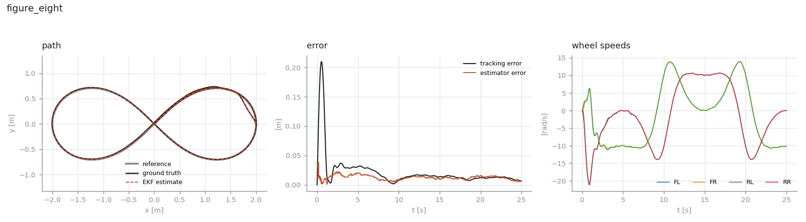
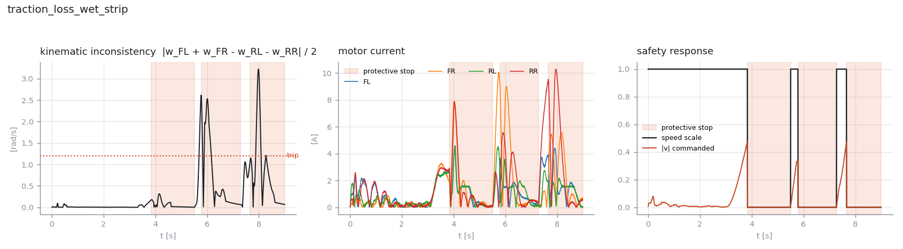
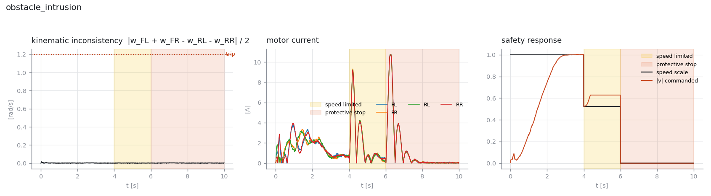

# omni-drive-core

**A real-time control core for a four-wheel holonomic AMR, with the validation harness that proves it works.**

C++17 control stack for a mecanum-wheeled autonomous mobile robot — the kind built by mounting four independently driven wheels under an existing cart or rack. The control law is compiled once and driven from three places without modification: a ROS 2 node, a Python physics simulator, and (by design) a microcontroller on the wheel itself.

[](https://github.com/PRAhit/omni-drive-core/actions/workflows/ci.yml)

| | |
|---|---|
| C++ unit tests | **35 passing**, `-Werror -Wconversion -Wshadow -Wold-style-cast` |
| Python tests | **57 passing** |
| Closed-loop scenarios | **11 passing** against numeric gates, over 12 random seeds |
| Control step cost | **35 µs** p99.9 — 0.7 % of a 5 ms budget at 200 Hz |
| Sanitizers | ASan + UBSan clean |

---

## Why this repository exists

Most robotics portfolio projects demonstrate that a controller *can* drive a robot. This one is built around a harder and more useful question: **how do you know the controller is right, and how do you keep knowing it?**

So the architecture is arranged around testability rather than around ROS:

```
                      ┌──────────────────────────────────┐
   cmd_vel ──────────▶│                                  │
   wheel_states ─────▶│         odc::DriveCore           │──▶ torque_cmd[4]
   imu/data ─────────▶│                                  │──▶ odom + TF
   scan ─────────────▶│  step(CycleInput, dt)            │──▶ diagnostics
   estop ────────────▶│                                  │
                      └──────────────────────────────────┘
                        no allocation · no I/O · no clock
                        no exceptions · no ROS · no globals
                                      │
              ┌───────────────────────┼───────────────────────┐
              ▼                       ▼                       ▼
      ROS 2 node               Python simulator         wheel-node MCU
      (topics, TF)             (pybind11, SIL)          (cross-compile)
```

`DriveCore::step()` is the entire real-time contract. Every dependency is passed in; every result is returned. It reads no clock, allocates nothing, throws nothing, and touches no global state. That is what makes the same object usable from a 200 Hz interrupt, from a ROS callback, and from a pytest case — and it is why the closed-loop scenarios below are testing *production control code*, not a Python re-implementation that will silently drift out of sync with it.

---

## Architecture

| Module | Responsibility |
|---|---|
| `MecanumKinematics` | Forward/inverse kinematics; exposes the kinematic redundancy as a diagnostic |
| `WheelController` ×4 | Velocity loop: PI + friction feedforward, slew limiting, back-calculation anti-windup |
| `PoseEkf` | 4-state EKF over `[x, y, θ, gyro_bias]`, Mahalanobis-gated absolute fixes |
| `SlipDetector` | Three-channel slip and traction-loss detection |
| `TrajectoryTracker` | Holonomic pose tracking, world-frame PI + feedforward |
| `SafetyMonitor` | Protective/warning fields, watchdogs, latching fault state machine |
| `DriveCore` | Orchestrates the above into one deterministic cycle |

### Kinematics

Wheel layout, REP-103 frame (x forward, y left, z up):

```
        x
        ▲
  FL[0] │ FR[1]
  ──────┼──────▶ y
  RL[2] │ RR[3]
```

Inverse (body twist → wheel speeds), with `L = lx + ly`:

```
ω_FL = (vx − vy − L·ωz) / r        ω_FR = (vx + vy + L·ωz) / r
ω_RL = (vx + vy − L·ωz) / r        ω_RR = (vx − vy + L·ωz) / r
```

The three columns of this map are mutually orthogonal, so the least-squares inverse is the exact Moore–Penrose pseudo-inverse and forward kinematics is a clean closed form. Four wheels, three degrees of freedom, one scalar of redundancy:

```
ω_FL + ω_FR − ω_RL − ω_RR = 0
```

Any violation is slip, an encoder fault, or wrong geometry — measured with no extra hardware.

### Slip detection: three channels, and why each is necessary

```
┌───────────────────────────────────────────────────────────────────────┐
│ 1. KINEMATIC     |ω_FL + ω_FR − ω_RL − ω_RR| / 2      →  70 ms        │
│    catches: seized bearing, wedged wheel, dead encoder                │
│    blind to: traction loss  (see below — this matters)                │
├───────────────────────────────────────────────────────────────────────┤
│ 2. INNOVATION    EKF normalised innovation squared    →  140 ms       │
│    catches: the platform actually sliding                             │
│    blind to: anything the scan matcher cannot see                     │
├───────────────────────────────────────────────────────────────────────┤
│ 3. GYRO          |ω_gyro − ω_odom|                    →  fast         │
│    catches: asymmetric slip that rotates the platform                 │
└───────────────────────────────────────────────────────────────────────┘
```

**What none of them catch:** all four wheels slipping equally in pure translation. That is genuinely unobservable from proprioception — there is no internal reference left to disagree with. The gated EKF is the backstop, which is why it never blindly trusts odometry.

---

## Results

Every scenario below carries numeric acceptance criteria and runs in CI. `tools/run_scenarios.py` exits non-zero on any gate failure, so a control regression breaks the build exactly like a failing unit test. Worst value across **12 seeds**:

| Scenario | Gate | Limit | Worst of 12 |
|---|---|---|---|
| `straight_line` | RMS tracking error | ≤ 0.05 m | **0.017** |
| | Peak tracking error | ≤ 0.12 m | **0.025** |
| | Step time p99.9 | ≤ 250 µs | **34.7** |
| `lateral_strafe` | RMS tracking error | ≤ 0.06 m | **0.017** |
| | Heading drift | ≤ 0.15 rad | **0.014** |
| `figure_eight` | RMS tracking error | ≤ 0.10 m | **0.017** |
| | RMS estimator error | ≤ 0.06 m | **0.013** |
| `spin_in_place` | Position drift | ≤ 0.20 m | **0.032** |
| `traction_loss_wet_strip` | Detection latency from real onset | ≤ 0.45 s | **0.14** |
| | Heading deviation | ≤ 0.25 rad | **0.108** |
| | Protective-stop entries | ≤ 3 | **3** |
| `traction_loss_single_wheel_absorbed` | RMS estimator error | ≤ 0.05 m | **0.031** |
| `wheel_jam` | Detection latency from real onset | ≤ 0.45 s | **0.07** |
| `obstacle_intrusion` | Stop latency | ≤ 0.05 s | **0** |
| | Speed after stop | ≈ 0 | **0** |
| `bus_dropout` | Bus fault latency | ≤ 0.05 s | **0** |
| `localisation_blackout` | Dead-reckoning drift | ≤ 0.50 m | **0.119** |
| `estop` | Latency | ≤ 0.02 s | **0** |
| | No self-clear after release | ≈ 0 | **0** |

Detection latency is measured from **ground-truth slip onset in the plant**, not from when the command was issued — timing from the command conflates controller latency with however long the physics took to break traction.

### Figure-of-eight at constant heading

Curved path with the body never turning: all three axes of the mecanum allocation are active continuously, so any sign error in the kinematics shows up immediately as drift off the loop.



### Wet strip across the aisle

Both left-side wheels lose grip during a hard start. Traction demand (19 N/wheel) exceeds what µ=0.05 can transmit (10 N), so the left side breaks away and the platform yaws.



### Obstacle intrusion

Linear speed ramp through the warning field, protective stop at the inner boundary, and extra clearance required before resuming.



---

## Five bugs this harness caught

The scenarios and plots are not decoration. Each of these was a real defect in code that looked fine and compiled clean.

**1 — The slip residual is rank-1 and cannot name a wheel.**
The first detector ranked per-wheel residual magnitudes. But the residual is the projection onto the single left-null direction, so it is *always* parallel to `[1, 1, −1, −1]` — all four entries share one magnitude. Ranking them is reading a four-way tie. A test now locks the property down so nobody "improves" it back.

**2 — Anti-windup gain was 2.0 when the rule of thumb is `ki/kp ≈ 13.3`.**
During a stall the integrator settled at 252 instead of ~5, because back-calculation reaches equilibrium at `ki·e / gain`. Caught by a test that compares against anti-windup disabled rather than asserting a magic number.

**3 — Kinematic consistency is structurally blind to traction loss.**
Under per-wheel velocity control the setpoints *come from* inverse kinematics, so four well-tracking wheels satisfy the constraint **by construction** however much the platform is sliding. This is the single most important property of the method and it is easy to miss: the check detects *tracking* failures, not *traction* failures. It drove the redesign into three channels.

**4 — Comparing wheel current against the fleet median false-positives constantly.**
The replacement for (3) assumed all four wheels carry comparable load. They do not: a figure-of-eight produces a normal 3.5 A spread, because a mecanum base loads its wheels very unevenly in curved motion. Replaced with the EKF innovation, which is the correct signal and was already being computed. A regression test now encodes the counter-example.

**5 — Two failures visible only in the plots.**
A single localisation outlier at a 1 % rate spiked NIS through an EWMA and protective-stopped a healthy robot on 3 seeds out of 8. Fixed by counting consecutive bad *fixes* rather than filtering a continuous statistic — three in a row is a one-in-a-million event. And the wet-strip trace showed the machine chattering in and out of protective stop **12 times**: slip trips a stop, the stop halts the wheels, still wheels report no slip, motion resumes, the wheels slip again. A minimum stop dwell turned that limit cycle into 3 clean stop-and-restart cycles.

One more result worth stating because it is *not* a bug: single-wheel traction loss on a four-wheel base is **absorbed**. Three healthy wheels take up the slack and estimator error stays inside 3 cm, so the innovation channel is correct not to fire. That is now its own scenario documenting graceful degradation, rather than pretending every traction event is an emergency.

---

## Build and run

### Prerequisites

| | |
|---|---|
| Compiler | any C++17 compiler — GCC 9+, Clang 10+, AppleClang 14+, MSVC 2019+ |
| CMake | 3.16 or newer |
| Python | 3.9+ for the harness and bindings; CI pins 3.11 |

GoogleTest is fetched by CMake at configure time, so the first configure needs
network access. Nothing else is vendored.

```bash
# macOS
xcode-select --install && brew install cmake python@3.11 clang-format

# Debian / Ubuntu
sudo apt install build-essential cmake python3-venv clang-format
```

### Python environment

A pybind11 extension module is built against one specific interpreter and will
not import into a different minor version. Use a virtual environment, and use
the same one for building and running:

```bash
python3.11 -m venv .venv && source .venv/bin/activate
pip install numpy matplotlib pytest pybind11 ruff
```

### Build

Two configurations. The first is what to use while working on the control core;
the second additionally builds the module the simulation harness imports.

```bash
# C++ core and unit tests
cmake -S . -B build -DCMAKE_BUILD_TYPE=Release -DODC_BUILD_TESTS=ON
cmake --build build -j

# ...and the pybind11 module
cmake -S . -B build -DCMAKE_BUILD_TYPE=Release -DODC_BUILD_PYTHON=ON \
  -Dpybind11_DIR=$(python -c "import pybind11; print(pybind11.get_cmake_dir())")
cmake --build build -j && cp build/omni_drive_core*.so python/
```

The `cp` is not incidental: `python/odc_sim` imports `omni_drive_core` from
alongside itself, so the freshly built module has to land in `python/` or every
simulation command below fails with `ModuleNotFoundError`.

| CMake option | Default | Effect |
|---|---|---|
| `ODC_BUILD_TESTS` | `ON` | GoogleTest suite (`odc_tests`) |
| `ODC_BUILD_PYTHON` | `OFF` | pybind11 module; requires `pybind11_DIR` |
| `ODC_WARNINGS_AS_ERRORS` | `ON` | `-Werror`, or `/WX` under MSVC |

### Testing

Three suites, all of which run in CI and all of which must pass.

#### C++ unit tests — 35 cases

```bash
ctest --test-dir build --output-on-failure       # through ctest
./build/odc_tests                                # or the binary directly
./build/odc_tests --gtest_filter='SlipDetector.*'  # one suite
./build/odc_tests --gtest_filter='*Estop*'         # one case
./build/odc_tests --gtest_list_tests               # enumerate without running
```

| Suite | Cases | What it pins down |
|---|---|---|
| `Kinematics` | 5 | forward/inverse round trip, strafe signs, rank-one residual |
| `WheelController` | 4 | convergence, torque limit, anti-windup, setpoint slew |
| `PoseEkf` | 5 | dead reckoning, fix correction, outlier rejection, gyro bias |
| `SlipDetector` | 11 | all three channels, plus the false-positive counter-examples |
| `SafetyMonitor` | 5 | field ramp, resume clearance, chatter, watchdog, e-stop latch |
| `DriveCore` | 5 | integration, protective stop, dead node, bitwise determinism |

#### Python tests — 57 cases

```bash
python -m pytest tests/ -q            # quiet
python -m pytest tests/ -v            # one line per case
python -m pytest tests/ -k ekf        # substring filter
python -m pytest tests/ -x            # stop at first failure
```

The count exceeds the nine test functions because the geometry and gate tests
are parametrised — over random seeds for the property checks, and over all 11
scenarios for `test_scenario_gates`.

#### Scenario acceptance gates — 11 scenarios

Closed-loop runs against the plant model, each with numeric limits. The runner
exits non-zero if any gate fails, so it is usable directly as a CI step.

```bash
python tools/run_scenarios.py                          # all scenarios, 1 seed
python tools/run_scenarios.py --seeds 12               # the table above
python tools/run_scenarios.py --only estop wheel_jam   # a subset
python tools/run_scenarios.py --json artifacts/scenarios.json
python tools/run_scenarios.py --no-color               # for logs
```

Scenario names for `--only`: `straight_line`, `lateral_strafe`, `figure_eight`,
`spin_in_place`, `traction_loss_wet_strip`,
`traction_loss_single_wheel_absorbed`, `wheel_jam`, `obstacle_intrusion`,
`bus_dropout`, `localisation_blackout`, `estop`.

Gates tuned against a single noise realisation are gates that pass by luck, so
CI runs 8 seeds and the table above reports the worst of 12.

### Tools

| Script | Purpose | Options |
|---|---|---|
| `tools/run_scenarios.py` | acceptance report; non-zero exit on failure | `--only`, `--seeds`, `--json`, `--no-color` |
| `tools/plot_scenarios.py` | regenerate the traces in `docs/img` | `--only`, `--out` |

```bash
python tools/plot_scenarios.py                     # rewrite docs/img
python tools/plot_scenarios.py --only figure_eight --out /tmp/plots
```

### Lint

```bash
ruff check python tools tests
find cpp bindings ros2_ws -name '*.cpp' -o -name '*.hpp' \
  | xargs clang-format --dry-run --Werror
```

### Sanitizers

The control path claims to be allocation-free and deterministic; sanitizers are
how that stays honest. Build into a separate directory so the normal build is
untouched:

```bash
cmake -S . -B build-asan -DCMAKE_BUILD_TYPE=Debug -DODC_BUILD_TESTS=ON \
  -DCMAKE_CXX_FLAGS="-fsanitize=address -fno-omit-frame-pointer" \
  -DCMAKE_EXE_LINKER_FLAGS="-fsanitize=address"
cmake --build build-asan -j
ASAN_OPTIONS=detect_leaks=1 ./build-asan/odc_tests
```

Substitute `undefined` for `address` to get the UBSan build, with
`UBSAN_OPTIONS=print_stacktrace=1:halt_on_error=1`.

### Everything at once

From a clean clone, this is the full check that CI performs:

```bash
python3.11 -m venv .venv && source .venv/bin/activate
pip install numpy matplotlib pytest pybind11 ruff
cmake -S . -B build -DCMAKE_BUILD_TYPE=Release -DODC_BUILD_PYTHON=ON \
  -Dpybind11_DIR=$(python -c "import pybind11; print(pybind11.get_cmake_dir())")
cmake --build build -j && cp build/omni_drive_core*.so python/
ctest --test-dir build --output-on-failure
python -m pytest tests/ -q
python tools/run_scenarios.py --seeds 12
ruff check python tools tests
```

### ROS 2 (Jazzy)

```bash
cd ros2_ws && colcon build && source install/setup.bash
ros2 launch omni_drive_ros drive.launch.py
```

ROS 2 Jazzy ships Linux binaries only. On macOS or Windows the wrapper builds in
a container, which is also what CI uses; the core and the whole simulation suite
need none of this.

```bash
docker run -it -v "$(pwd)":/ws -w /ws/ros2_ws ros:jazzy-ros-base \
  bash -c "source /opt/ros/jazzy/setup.bash && colcon build"
```

### VS Code

`.vscode/` configures the workspace: IntelliSense reads the generated
`compile_commands.json`, the Test panel picks up pytest, and **Terminal → Run
Task…** exposes the commands above in order — `1. venv + deps`, `2. build core +
tests`, `3. build bindings`, then the test, scenario, plot and lint tasks.
Select the `./.venv/bin/python` interpreter once and the rest follows.

### ROS 2 interface

| Direction | Topic | Type |
|---|---|---|
| in | `cmd_vel` | `geometry_msgs/Twist` |
| in | `wheel_states` | `sensor_msgs/JointState` (velocity, effort) |
| in | `imu/data` | `sensor_msgs/Imu` |
| in | `scan` | `sensor_msgs/LaserScan` |
| in | `estop` | `std_msgs/Bool` |
| out | `odom` + TF | `nav_msgs/Odometry` |
| out | `wheel_commands` | `sensor_msgs/JointState` |
| out | `/diagnostics` | `diagnostic_msgs/DiagnosticArray` |
| srv | `reset_faults` | `std_srvs/Trigger` |

Velocity commands are integrated into a moving **pose** reference rather than passed through, so the tracker closes a position loop. That is what stops the platform drifting off an aisle centre line over a 40 m run.

---

## Layout

```
cpp/include/odc/   control core headers
cpp/src/           implementations
cpp/tests/         35 GoogleTest cases
bindings/          pybind11 module
python/odc_sim/    plant model, SIL harness, 11 scenarios
tools/             scenario runner (CI gate), plot generator
ros2_ws/           ROS 2 wrapper package
tests/             pytest suite
```

## Design notes

- **Fixed-step, explicit state.** No `std::chrono` inside the core. `dt` is an argument, so a replay of recorded inputs reproduces recorded outputs bit-for-bit — there is a test asserting exactly that.
- **Latching faults.** An e-stop or a dead wheel node does not self-clear because the next frame looked fine. Clearing requires an explicit `reset()` from a supervisor.
- **Safety scales, then clips.** Speed limiting multiplies the twist rather than clipping per-axis, preserving the *direction* of motion while the magnitude ramps down.
- **One circular dependency, resolved explicitly.** The EKF inflates process noise during slip and the slip detector consumes the EKF innovation. The filter uses the previous cycle's verdict: a 5 ms lag against a fault that persists for hundreds of milliseconds.

MIT licensed.

---

## Provenance

Written from published fundamentals, not derived from any company's codebase.
Mecanum kinematics dates to Ilon's 1972 patent and appears in every mobile
robotics textbook; the estimator is a standard EKF; the velocity loops use
back-calculation anti-windup from the classical control literature; the
protective and warning field behaviour follows the shape described in
ISO 3691-4. The parameter values are plausible figures for a loaded cart, not
measurements from any real product.

No third-party source is vendored here. GoogleTest is fetched at build time
and pybind11 comes from pip; NumPy and Matplotlib are used only by the
simulation and plotting tools. All are permissively licensed.

No affiliation with, or endorsement by, any robotics manufacturer. Product and
company names, if mentioned anywhere, belong to their respective owners.
