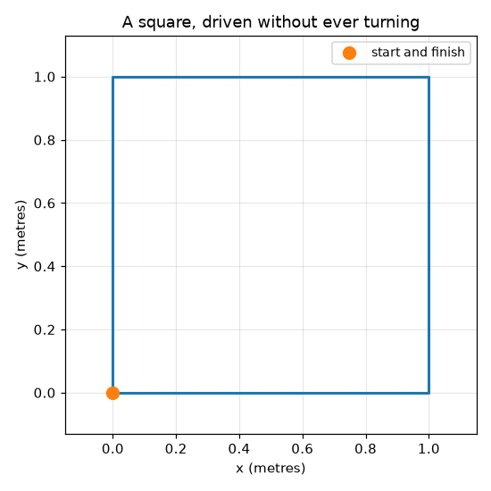

# Mecanum Robot Simulator

**What this project does, in five points:**

1. It pretends to be a robot with four **mecanum wheels** — the special kind that
   can slide sideways without turning first.
2. You tell it how you want to move — forwards, sideways, or spin — and it works
   out **how fast each of the four wheels has to turn**.
3. It does the reverse too: given the four wheel speeds, it works out **which way
   the robot must be moving**. That is how a real robot guesses where it has got to.
4. It can **drive itself to a point** you pick, speeding up when far away and
   slowing down as it arrives.
5. It **draws pictures** of everything it does, and **8 tests** check the maths
   is right.

It is a simulation, not a real robot. There is no hardware, and the wheels always
do exactly what they are told.

---

A small hobby project I built to understand how robots with **mecanum wheels**
drive sideways.

Most robots, like most cars, have to turn before they can change direction. A
robot on mecanum wheels does not — it can slide straight sideways while still
facing forwards. I thought that was a neat trick, and I wanted to understand the
maths well enough to write it down myself, so I built a little simulator.

There is no real robot here. It is about 250 lines of Python that works out how
fast each wheel should spin, pretends to drive the robot around, and draws the
path it took.



That square was driven without the robot turning even once. It went forward,
then left, then backward, then right, and finished exactly where it started,
still facing the same way.

---

## The trick, in one picture

All four wheels are identical. The only thing that changes between driving
forwards, sliding sideways, and spinning on the spot is **which direction each
wheel turns**.


- **Forwards** — all four wheels spin the same way. No surprise there.
- **Sideways** — one diagonal pair spins forwards, the other backwards. Because
  mecanum wheels have angled rollers, each wheel pushes the robot diagonally.
  Set the diagonals fighting each other and the forwards and backwards parts
  cancel out, leaving only a sideways push. That is the whole trick.
- **Spinning** — the left wheels go one way and the right wheels the other,
  exactly like a tank.

---

## How it works

Three small files, each doing one job.

### `mecanum.py` — the wheel maths

Given the motion you want, work out the four wheel speeds:

```python
wheel_speeds(vx=0, vy=0.5, omega=0)   # slide left at 0.5 m/s
# -> [-10.0, 10.0, -10.0, 10.0]       # the diagonal pattern from the picture
```

It also does the reverse — read the wheel speeds and work out how the robot must
be moving. A real robot uses this to estimate where it has got to, by counting
how far its motors have turned.

### `robot.py` — the pretend robot

Keeps track of where the robot is and nudges it forward 20 milliseconds at a
time. Lots of small nudges add up to smooth motion, like frames in a film.

The one thing here that took me a while: the robot thinks in "forward" and
"left", but the map thinks in x and y. If the robot is facing east and I tell it
to drive forward, it moves east — so before I can draw anything I have to rotate
the robot's own motion by whichever way it happens to be pointing.

### `drive_to.py` — driving to a point

The simplest controller that works: measure how far away the target is, and
drive towards it at a speed proportional to that distance. Far away means go
fast, close means slow down, arrived means stop.


This is the "P" of a PID controller on its own. I capped the speed so it cannot
bolt off, and added a small "close enough" distance so it stops instead of
fidgeting forever.

---

## Running it

You need Python 3. Then:

```bash
pip install matplotlib pytest

python3 demo.py            # runs the demos, saves the pictures
python3 -m pytest -v       # runs the tests
```

`demo.py` prints what happened and writes three pictures into `images/`.

---

## The tests

There are 8, and every one of them is a mistake I actually made:

```
test_driving_forward_spins_every_wheel_the_same_way
test_sliding_sideways_splits_the_wheels_into_two_pairs
test_spinning_turns_the_left_and_right_sides_opposite_ways
test_the_maths_undoes_itself
test_a_robot_facing_sideways_still_goes_where_you_point_it
test_it_slows_down_as_it_arrives
test_it_stops_when_it_gets_there
test_the_square_comes_back_to_the_start
```

The most useful one is `test_the_maths_undoes_itself`. It asks for a motion,
works out the wheel speeds, then reads those wheel speeds back — and the answer
has to match what was asked for. I had a sign wrong in the sideways formula for
an embarrassingly long time, and this is the test that finally caught it.

The other one worth mentioning is
`test_a_robot_facing_sideways_still_goes_where_you_point_it`. It starts the
robot facing three different directions and checks it reaches the same target
every time. That is where a rotation mistake shows up, and it did.

---

## What I learned

- **Mecanum wheels are just four diagonal pushes added together.** Once that
  clicked, the formulas stopped looking like magic.
- **Getting the signs right is most of the work.** The maths is short. Keeping
  straight which way is left and which way is positive is the actual difficulty.
- **A round-trip test is worth more than a lot of careful staring.** Convert one
  way, convert back, check you got what you started with.
- **Simulating first is a good idea.** I could try things instantly, and none of
  my sign errors cost me a broken robot.

## What I would do next

- Add wheels that do not respond instantly, since real motors take time to speed
  up.
- Add a little noise to the wheel readings and see how far the position estimate
  drifts. I understand that drift is the reason real robots need something else
  to correct their position, and I would like to see it happen.
- Try a path made of curves instead of straight lines between points.
- Put it on real hardware and find out everything the simulation was too kind
  about.

---

*A learning project. The maths comes from the standard mecanum kinematics you
can find in any robotics textbook; the code, the mistakes, and the tests are
mine.*
