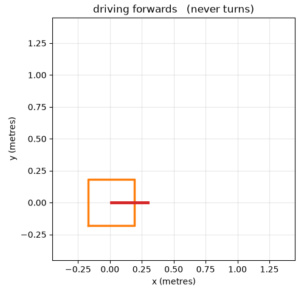
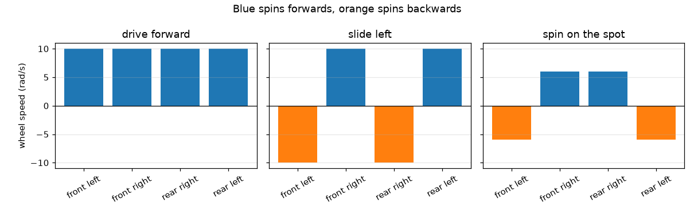
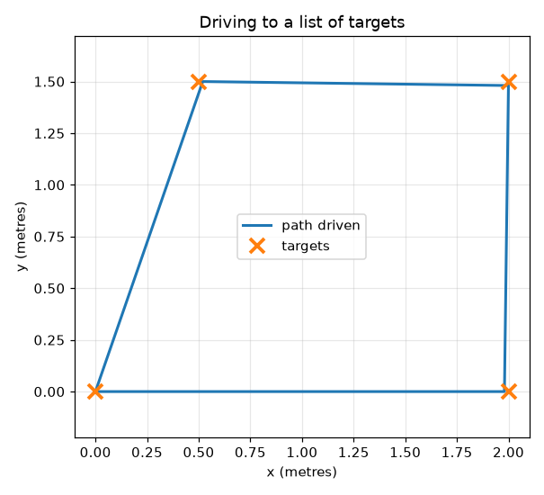

# Mecanum Robot Simulator

A small Python project I built to understand how robots with **mecanum wheels**
drive sideways.



Watch the red arrow. It never moves — the robot is driving a complete square
without turning even once. A car has to point where it is going; this robot
does not.

You tell it how you want to move, it works out how fast each of the four wheels
must spin, and it draws what happens. Under 200 lines of Python for the robot
itself, and no hardware anywhere.

**Try it in thirty seconds:**

```bash
pip install -r requirements.txt
python3 demo.py            # runs it and makes the charts below
python3 -m pytest -v       # runs the 8 tests
```

Every picture in this README is produced by the code — `demo.py` writes the
charts and `animate.py` writes the animation above. Nothing here is drawn by
hand.

---

## The trick, in one picture

All four wheels are identical. The only thing that changes between driving
forwards, sliding sideways, and spinning on the spot is **which direction each
wheel turns**.



- **Forwards** — all four wheels spin the same way. No surprise there.
- **Sideways** — one diagonal pair spins forwards, the other backwards. Because
  mecanum wheels have angled rollers, each wheel pushes the robot diagonally.
  Set the diagonals fighting each other and the forwards and backwards parts
  cancel out, leaving only a sideways push. That is the whole trick.
- **Spinning** — the left wheels go one way and the right wheels the other,
  exactly like a tank.

---

## How it works

Three small files, each doing one job.

### `mecanum.py` — the wheel maths

Given the motion you want, work out the four wheel speeds:

```python
wheel_speeds(vx=0, vy=0.5, omega=0)   # slide left at 0.5 m/s
# -> [-10.0, 10.0, -10.0, 10.0]       # the diagonal pattern from the picture
```

It also does the reverse — read the wheel speeds and work out how the robot must
be moving. A real robot uses this to estimate where it has got to, by counting
how far its motors have turned.

### `robot.py` — the pretend robot

Keeps track of where the robot is and nudges it forward 20 milliseconds at a
time. Lots of small nudges add up to smooth motion, like frames in a film.

The one thing here that took me a while: the robot thinks in "forward" and
"left", but the map thinks in x and y. If the robot is facing east and I tell it
to drive forward, it moves east — so before I can draw anything I have to rotate
the robot's own motion by whichever way it happens to be pointing.

### `drive_to.py` — driving to a point

The simplest controller that works: measure how far away the target is, and
drive towards it at a speed proportional to that distance. Far away means go
fast, close means slow down, arrived means stop.



This is the "P" of a PID controller on its own. I capped the speed so it cannot
bolt off, and added a small "close enough" distance so it stops instead of
fidgeting forever.

---

## Running it

You need Python 3. Then:

```bash
pip install -r requirements.txt

python3 demo.py            # run the demos and save the charts
python3 animate.py         # save the animation at the top of this page
python3 -m pytest -v       # run the tests
```

Everything lands in `images/`:

| Command | Writes |
|---|---|
| `demo.py` | `square.png`, `targets.png`, `wheels.png` |
| `animate.py` | `robot.gif` |

`demo.py` also prints a short summary of each demo, so you can see the numbers
without opening the pictures. `animate.py` is slower — it draws 100 frames — so
it is kept separate rather than run every time.

You can also poke at the maths directly:

```bash
python3 -c "import mecanum; print(mecanum.wheel_speeds(0, 1, 0))"
# [-20.0, 20.0, -20.0, 20.0]   <- sliding left at 1 m/s
```

Change the three numbers (forward, sideways, turn) and watch the wheel pattern
change.

---

## The tests

There are 8, and most of them are a mistake I actually made:

```
test_driving_forward_spins_every_wheel_the_same_way
test_sliding_sideways_splits_the_wheels_into_two_pairs
test_spinning_turns_the_left_and_right_sides_opposite_ways
test_the_maths_undoes_itself
test_a_robot_facing_sideways_still_goes_where_you_point_it
test_it_slows_down_as_it_arrives
test_it_stops_when_it_gets_there
test_the_square_comes_back_to_the_start
```

The most useful one is `test_the_maths_undoes_itself`. It asks for a motion,
works out the wheel speeds, then reads those wheel speeds back — and the answer
has to match what was asked for. I had a sign wrong in the sideways formula for
an embarrassingly long time, and this is the test that finally caught it.

The other one worth mentioning is
`test_a_robot_facing_sideways_still_goes_where_you_point_it`. It starts the
robot facing three different directions and checks it reaches the same target
every time. That is where a rotation mistake shows up, and it did.

---

## What I learned

- **Mecanum wheels are just four diagonal pushes added together.** Once that
  clicked, the formulas stopped looking like magic.
- **Getting the signs right is most of the work.** The maths is short. Keeping
  straight which way is left and which way is positive is the actual difficulty.
- **A round-trip test is worth more than a lot of careful staring.** Convert one
  way, convert back, check you got what you started with.
- **Simulating first is a good idea.** I could try things instantly, and none of
  my sign errors cost me a broken robot.

## What I would do next

Right now the robot drives blind — it follows the commands it is given and has
no idea whether anything is in the way. **Giving it a sensor is the next step I
want to take**, and the first thing I would do with the reading is the simplest
rule there is:

```python
speed = 0.0 if ahead < STOP_DISTANCE else SPEED
```

Drive at full speed, and stop the moment the nearest thing ahead gets closer
than some threshold. That one line is the whole of "look, decide, act, repeat",
which is the loop everything more advanced is built on. I want to work through
what it actually takes to produce that `ahead` number — simulating a distance
sensor, deciding which directions count as "ahead", and picking a threshold that
leaves enough room to stop.

After that, steering *around* an obstacle rather than stopping at it. The robot
can slide sideways, so it should be able to strafe past something without
turning, and I haven't used that capability for anything useful yet.

Further out:

- **Add wheels that do not respond instantly**, since real motors take time to
  speed up.
- **Watch the position estimate drift.** With noisy wheel readings the robot's
  guess at where it is would slowly wander away from the truth. That drift is
  the reason real robots need something else to correct themselves, and I would
  rather see it happen than read about it.
- **Put it on real hardware** and find out everything the simulation was too kind
  about.

---

## Where the maths comes from

I did not invent any of the kinematics. The four wheel-speed equations in
`mecanum.py` are the standard mecanum model, and these are the sources it comes
from:

- **Kevin M. Lynch and Frank C. Park, *Modern Robotics: Mechanics, Planning,
  and Control*, Cambridge University Press, 2017** — Chapter 13.2,
  "Omnidirectional Wheeled Mobile Robots", is the clearest derivation I found of
  why four mecanum wheels give you three degrees of freedom.
  The full book is free as a PDF:
  [hades.mech.northwestern.edu/images/7/7f/MR.pdf](https://hades.mech.northwestern.edu/images/7/7f/MR.pdf) ·
  [chapter page](https://modernrobotics.northwestern.edu/nu-gm-book-resource/13-2-omnidirectional-wheeled-mobile-robots-part-2-of-2/) ·
  [lecture video](https://www.youtube.com/watch?v=NcOT9hOsceE)

- **H. Taheri, B. Qiao and N. Ghaeminezhad, "Kinematic Model of a Four Mecanum
  Wheeled Mobile Robot", *International Journal of Computer Applications*,
  113(3), pp. 6-9, 2015** — a short paper that writes out the forward and
  inverse kinematics for exactly this four-wheel layout.
  [ijcaonline.org](https://www.ijcaonline.org/archives/volume113/number3/19804-1586/) ·
  doi:[10.5120/19804-1586](https://doi.org/10.5120/19804-1586)

- **Bengt Erland Ilon, US Patent
  [US3876255A](https://patents.google.com/patent/US3876255A/en), filed 1972** —
  the original wheel. Ilon was an engineer at the Swedish company Mecanum AB,
  which is where the name comes from. Worth two minutes just to see the 45
  degree rollers drawn by the person who thought of them.
  ([overview on Wikipedia](https://en.wikipedia.org/wiki/Mecanum_wheel))

---

*A learning project. The maths is the standard mecanum kinematics, from the
sources listed above; the code, the mistakes, and the tests are mine.*
